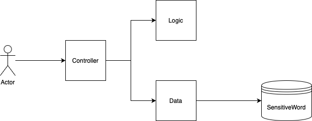

# Architecture

This project contains multiple packages, providing a separation between logic and other required functionality.
<br>The following packages has been defined

* Logic : This package contains the business logic to find and sanitize text using regular expressions. 
* Data: This package contains all the code to perform the crud operations on the database.<br>
An ORM Library (GORM) has been implemented to achieve this functionality for both Microsoft SQL Server and SQL Lite.
* Controller: This packages manages all the HTTP Rest Services using GIN and contains the swagger definitions



As seen in this diagram Logic never initiates a call to the Data package, all data is retrieved prior to calling the filtering
code, managed by the controller package. This design allows for complete unit testing, and security due to the 
separation of concerns.

Each of these packages has multiple unit tests located in the following files
* controller/controller_test.go
* data/data_test.go
* logic/logic_test.go

# Assumptions

* The service has been designed to be case insensitive. All data will be stored on the database as uppercase. 
* The only special character that is supported is "*" due to it being a very common character in SQL. Any other special regular expression characters is not supported. 
* The API has been designed to support bulk requests, therefore all interaction objects contain an array of strings.
```
controller.Sanitize{
  sentences	[string]
}
```
```
controller.SanitizeWord{
  words	[string]
}
```
* The sql_sensitive_list will be loaded on first run, and there after ignored. Once loaded the file will be renamed to sql_sensitive_list.processed
* The release version runs under Docker.
* By default the image will listen on port 8080, but this can be modified by editing the docker-compose file.
* Due to the structure of the database, the update functionality will first delete the record, and then add a new one. 
* SQL Lite is being used for running units tests, as it is a quick way to test SQL queries. 

# Building Instructions
A build script has been provided make.sh that runs on Linux Based Systems. This requires the latest version of Go available at https://go.dev. Running this script will build the latest 
swagger files, compile the application and setup a docker image. The latest release version is located under releases. 

# Installation Instructions
Setting up and running the service requires the latest version of Docker. 
* The latest version of the service is available under https://github.com/jacohanekom/sanitize/releases or under the release directory for a local build. 
* Once downloaded, untar the latest release for example 
```tar xvf 20241106220408.tar.gz```
* This will produce 4 files
   - docker-compose.yml
   - swagger.json
   - swagger.yaml
   - sanitize.tar
* Run the following command to load the image in the docker daemon ```docker load < sanitize.tar```
* The service can be started by running ```docker compose up -d```
* Should you wish to display the swagger interface it can be enabled in the docker compose file by setting the field swaggerInterface to true. It can be accessed with the URL,
http://127.0.0.1:8080/swagger/index.html. Where 127.0.0.1:8080 is the host and port where the service is running. 

# Sample Curl Requests 
The following is sample curl requests that can be used to verify whether the service is running correctly. localhost:8080 
should be replaced with the applicable host and port 
* Sanitize string
```
curl -X 'POST' \
  'http://localhost:8080/api/v1/sanitize' \
  -H 'accept: application/json' \
  -H 'Content-Type: application/json' \
  -d '{
  "sentences": [
    "test"
  ]
}'
```
* Returns all loaded sanitized words
```
curl -X 'GET' \
  'http://localhost:8080/api/v1/words' \
  -H 'accept: application/json'
```
* Add one or more sanitized words
```
curl -X 'PUT' \
  'http://localhost:8080/api/v1/words' \
  -H 'accept: application/json' \
  -H 'Content-Type: application/json' \
  -d '{
  "words": [
    "sample", "sample unit"
  ]
}'
```
* Update one or more sanitized words
```
curl -X 'POST' \
  'http://localhost:8080/api/v1/words' \
  -H 'accept: application/json' \
  -H 'Content-Type: application/json' \
  -d '{
  "words": [
    "sample", "sample replacement"
  ]
}'
```
* Remove one or more sanitized words
```
curl -X 'DELETE' \
  'http://localhost:8080/api/v1/words' \
  -H 'accept: application/json' \
  -H 'Content-Type: application/json' \
  -d '{
  "words": [
    "sample replacement"
  ]
}'
```
# Changes Required for running this service in production 
* By default the docker-compose file ensures that the Microsoft SQL Server is started within docker. For production this service should point to
  an external database.
* The endpoints should be served through HTTPS, a Load Balancer and a Web Application Firewall.The web server should be configured to enforce authentication. 
* Should the service runs into performance issues, it will be advantageous to introduce caching to increase response times and reduce database bottlenecks. 
